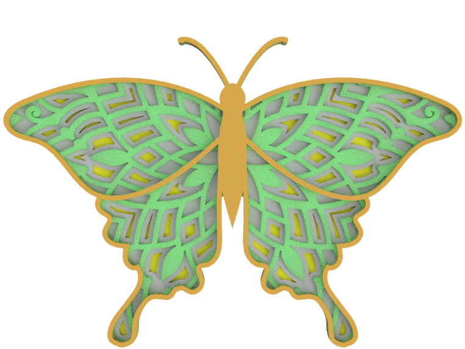
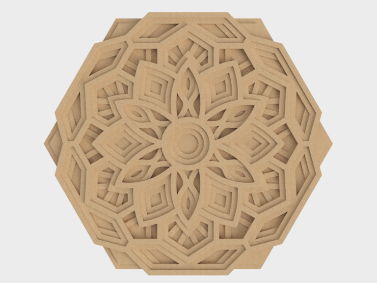
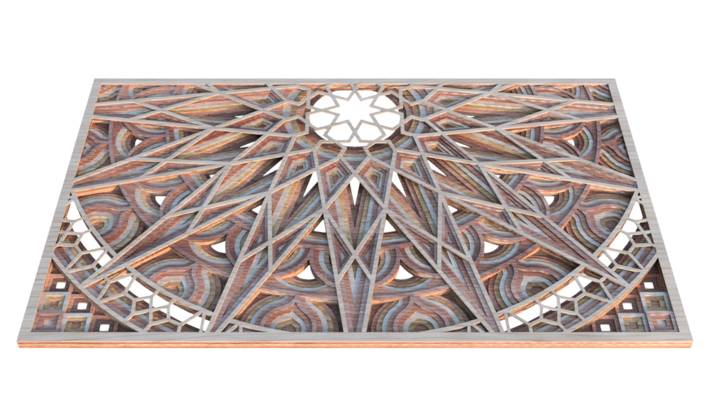
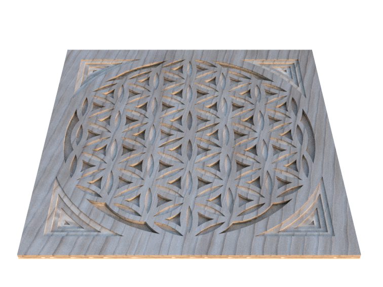

# CNC-Router-Cutting-Path-File-Mandala-Design-Digital-Download-Part1
This is a digital cut file created for CNC router machines. The file contains a detailed mandala design with a precise cutting path program generated in G-code (.nc) format, customized according to machine specifications.  The intricate geometric mandala pattern is ideal for wood, acrylic, or foam board carving,producing a clean and elegant relief effect.
An accompanying .STL file is included for 3D preview, editing, or toolpath simulation.

File Formats:

G-code (.nc) – ready to use on compatible CNC routers

STL – 3D model file

Perfect for:
Decorative wall panels, furniture inlays, laser or CNC art projects, and architectural ornamentation.
         

In addition to the G-code file, an .STL file is included for 3D visualization, toolpath simulation, or design modification before cutting.

Included in the download:

G-code (.nc) — ready to run on compatible CNC router machines

STL file — 3D model for preview or editing

Perfect for creating:

Decorative wall panels

Furniture inlays

Interior decor pieces

Architectural ornaments

Woodworking, acrylic cutting, and foam board projects

Additional Information:

This is a digital file, no physical product will be shipped

The cutting path is optimized for smooth and precise machining

The mandala design features proportional relief depth, making it ideal for 2.5D CNC carving

Suitable for small commercial use depending on the designer’s licensing policy

Features:

Intricate mandala relief pattern with multi-level depth

Clean toolpath generation for smooth carving

Compatible with most CNC router software and controllers

Suitable for materials like wood, MDF, plywood, acrylic, PVC, and foam board

Designed for 2.5D CNC carving projects

Recommended Uses:

Wall art panels

Decorative wooden plaques

Furniture inlays and ornamental accents

Interior design elements

Artistic CNC craft projects
